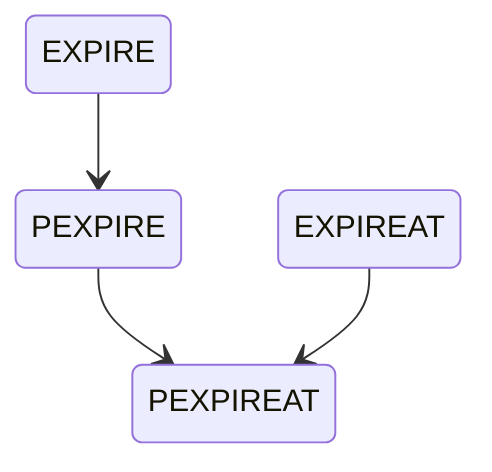

# 数据库

```c
typedef struct redisServer{
    ...
    // 数据库数量
    int dbnum;
    // 数据库数组
    redisDb *db;
    ...
}
```


# 数据库切换

```c
typedef struct redisClient{
    redisDb *db;
} redisClient;
```


# 数据库字典

```c
typedef struct redisDb{
    dict *dict;
} redisDb;
```


# 过期时间

## 过期命令

| command       | unit              | description |
| ------------- | ----------------- | ----------- |
| ``EXPIRE``    | ``s``             | ``ttl``     |
| ``PEXPIRE``   | ``ms``            | ``ttl``     |
| ``EXPIREAT``  | ``timestamp(s)``  | ``data``    |
| ``PEXPIREAT`` | ``timestamp(ms)`` | ``data``    |



## 过期存储

```c
typedef struct redisDb{
    dict *expires;
} redisDb;
```


## 过期解除

| command     | opposite      |
| ----------- | ------------- |
| ``PERSIST`` | ``PEXPIREAT`` |

## 剩余时间

| command  | unit   | description |
| -------- | ------ | ----------- |
| ``TTL``  | ``s``  | ``ttl``     |
| ``PTTL`` | ``ms`` | ``ttl``     |

## 过期检查

```flow
start=>start: key
expire=>operation: expire
unexpire=>operation: unexpire
inexpire=>condition: in expire?
overNow=>condition: timestamp > now ?
end=>end: end
start->inexpire(no)->unexpire->end
inexpire(yes)->overNow(yes, right)->unexpire
overNow(no)->expire->end
```

# 过期删除策略

| 删除策略 | 操作描述                     | 内存影响                 | CPU影响                 | 信息补充                                 |
| -------- | ---------------------------- | ------------------------ | ----------------------- | ---------------------------------------- |
| 定时删除 | 设置定时器，及时删除过期键   | 内存友好，及时释放       | CPU不友好，大量检测任务 | 太多定时，挤压CPU，降低服务吞吐量        |
| 惰性删除 | 不主动删除，内存紧张检查删除 | 内存不友好，内存占用     | CPU友好，少量任务       | 过多无访问数据，近似内存泄漏             |
| 定期删除 | 周期性进行过期检查和删除操作 | 释放不及时，但是也不压迫 | 有一些任务，但是不太多  | 周期不当，偏向存粹的定时删除或者多项删除 |

# Redis过期删除

## 定时删除

``Redis``创建定时器依赖时间事件，当前的时间事件实现是一个无序列表，查找复杂度为$O(N)$，无法高效处理大量时间事件。

因此，``Redis``暂时并不支持定时删除。

## 惰性删除

在进行读写操作之前，使用``db.c/expireIfNeeded``进行检查。

```flow
start=>start: ops
check=>condition: expire ?
expire=>operation: do expire
ops=>operation: do ops
end=>end: return
start->check(no)->ops->end
check(yes)->expire->ops
```

## 定期删除

定期删除涉及两个方法``redis.c/serverCron``定时调度和``redis.c/activeExpireCycle``过期清理。

其中的关键点在于：定期的删除任务并非是一次性全部删除，而是状态记录的周期触发。

```flow
start=>start: cron
loadStatus=>operation: 继续上次删除进度
limit=>condition: 时间上限?
saveStatus=>operation: 保存进度
end=>end: end
overDB=>condition: 当前DB无过期键?
nextDB=>operation: nextDB
random=>operation: 随机检查删除过期键
start->loadStatus->limit(yes, right)->saveStatus->end
limit(no)->overDB(yes)->nextDB(right)->limit
overDB(no, left)->random(right)->limit
```

# 过期影响

## RDB

| operation | description                                                  |
| --------- | ------------------------------------------------------------ |
| 导出      | 导出时候过期键一律忽略                                       |
| 导入      | 主服务器：自动过滤过期键<br />从服务器：不过滤过期键，一律听从主服务器指挥 |

## AOF

| operation | description                                          |
| --------- | ---------------------------------------------------- |
| 写入      | 如果没有具体的删除操作，``AOF``就不会存在``DEL``语句 |
| 重写      | 重写过程中，自动忽略过期键                           |

## 复制

| role       | description                          |
| ---------- | ------------------------------------ |
| ``master`` | 负责过期监听、操作和命令下发         |
| ``slave``  | 啥也不做，叫做啥就做啥，不发话不动作 |