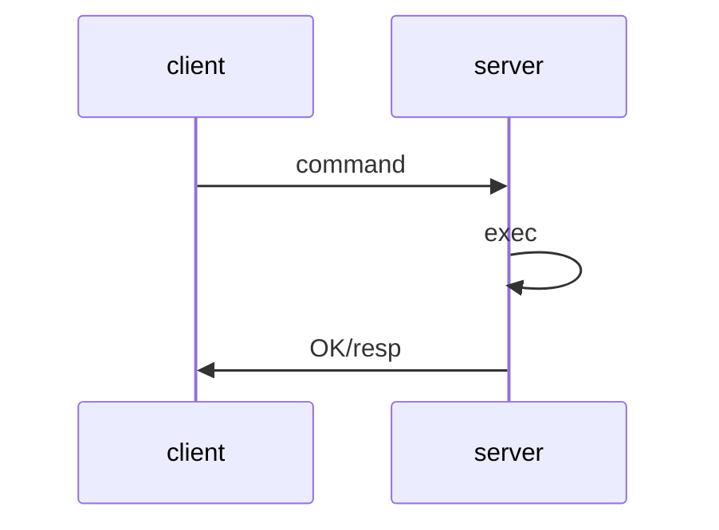
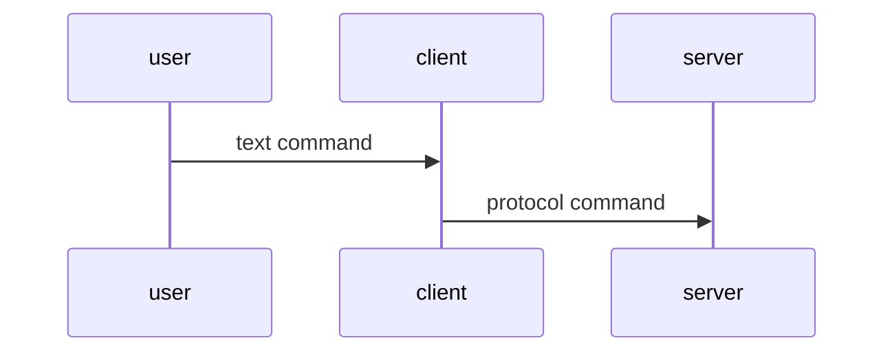
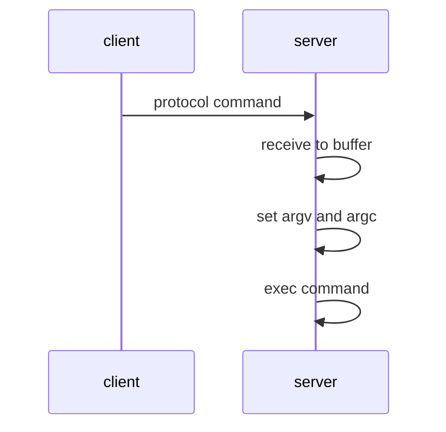
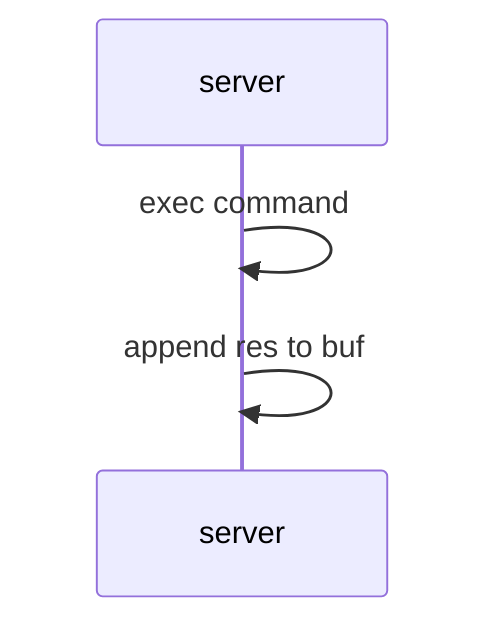
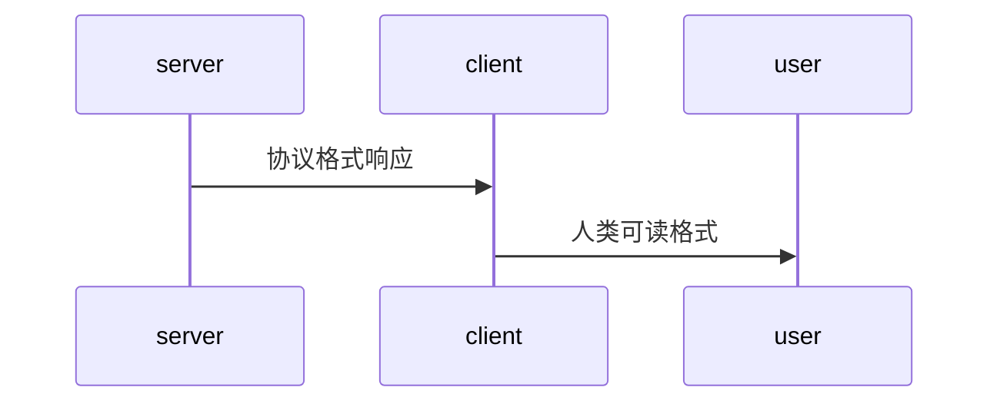

# 初始化

## 创建初始化

``redis.c/initServerConfig``负责初始化，初始化内容包括

- 服务器运行``ID``
- 默认运行频率
- 配置文件路径
- 服务运行架构
- 服务器端口号
- ``RDB``或``AOF``
- ``LRU``时钟初始化
- 创建命令表

## 配置加载

```flow
start=>start: load config
more=>condition: more propertiy ?
prop=>operation: get property
cover=>operation: cover config
end=>end: end
start->more(no,left)->end
more(yes)->prop(right)->cover(right)->more
```

## 管理初始化

为避免重复设置，基础设置确定以后才进行上层管理的数据设置以及一些操作。

- 属性设置

| attribute                  | description     |
| -------------------------- | --------------- |
| ``server.clients``         | 客户端链表      |
| ``server.db``              | 数据库          |
| ``server.pubsub_channels`` | 频道订阅信息    |
| ``server.pubsub_patterns`` | 模式订阅信息    |
| ``server.lua``             | ``lua``执行环境 |
| ``server.slowlog``         | 慢查询日志      |
- 动作执行

| operation                    | description                                                  |
| ---------------------------- | ------------------------------------------------------------ |
| 设置进程信号处理器           |                                                              |
| 创建共享对象                 | ``OK``<br />``ERR``<br />``0-10000``                         |
| 监听端口，设置事件处理器     |                                                              |
| 为``serverCron``设置时间事件 |                                                              |
| 检查、准备``AOF``            | ``AOF``功能打开，准备``AOF``<br />如果``AOF``文件不存在，创建 |
| 初始化``I/O``                |                                                              |

## 数据还原

```flow
start=>start: 服务启动
AOF=>condition: 是否启用AOF
doAOF=>operation: 载入AOF
doRDB=>operation: 载入RDB
end=>end: 载入完毕
start->AOF(yes)->doAOF->end
AOF(no)->doRDB->end
```

## 时间循环

<font color='red'>开始执行时间循环，服务初始化完毕。</font>

# 定时任务

| 任务名称                   | 任务说明                                                     | 任务内容                                                     |
| -------------------------- | ------------------------------------------------------------ | ------------------------------------------------------------ |
| 时间缓存                   | 每``100ms``更新<br />``unixtime``：秒级时间戳<br />``mstime``：毫秒级时间戳 | 适用精度不高任务：<br />日志打印 <br />``LRU``时钟更新<br />持久化执行判断<br />``uptime``计算 |
| ``LRU``时钟                | 默认``10s``更新``lruclock``                                  | 对象操作时候默认取服务器``lrulock``<br />$\text{idle} = \text{lru}_s - \text{lru}_o$ |
| 每秒执行命令次数           | ``100ms``执行一次                                            | ``instantaneous_ops_per_sec``                                |
| 更新服务器内存峰值         |                                                              | ``server.stat_peek_memory``                                  |
| 处理``SIGTERM``信号        |                                                              | 持久化数据，关闭服务                                         |
| 客户端管理                 |                                                              | 超时释放：客户端超时<br />缓冲释放：清理缓冲，回收内存       |
| 数据管理                   |                                                              |                                                              |
| 执行延迟的``BGREWRITEAOF`` | ``instantaneous_ops_per_sec=1``，标记延迟                    | ``BGREWRITEAOF``在``BGSAVE``执行时候需要延迟执行             |
| 持久化任务                 | 执行持久化操作                                               | 详情见下                                                     |
| ``AOF``缓存同步            | 如果开启``AOF``                                              | 将缓存同步到文件                                             |
| 关闭异步客户端             |                                                              | 关闭缓存超标的客户端                                         |
| 循环计数                   | 记录循环次数                                                 | ``cronloops+1``                                              |

==持久化任务==

```c
struct redisServer{
    pid_t rdb_child_pid;
    pid_t aof_child_pid;
}
```

- 持久化检查(``rdb_child_pid != -1 || aof_child_pid != -1``)
  - 检测子进程发送的持久化操作是否完毕，完成持久化文件(``RDB or AOF``)的替换；没有检测到则不操做。

- 非持久化操作(``rdb_child_pid == -1 && aof_child_pid == -1``)
  - 检测是否有延迟的``BGREWRITEAOF``，有则执行
  - 检测``BGSAVE``自动保存条件是否满足，满足则执行持久化操作
  - 检测``AOF``重写条件是否满足，否则重写``AOF``

```flow
start=>start: cron
noSave=>condition: 正在进行持久化?
delay=>condition: 有延迟的BGREWRITEAOF?
autoSave=>condition: auto save ?
rewrite=>condition: rewrite ?
doRewrite=>operation: BGREWRITEAOF
save=>operation: BGSAVE
start->noSave(yes)->delay(yes)->doRewrite
delay(no, left)->autoSave(yes)->save
autoSave(no, left)->rewrite(yes, right)->doRewrite
```

# 命令执行



## 命令发送



## 命令读取



## 命令查找

命令全部存储在命令表(``command table``)中

| key     | value            |
| ------- | ---------------- |
| ``SDS`` | ``redisCommand`` |

==redisCommand==

| field            | type                   | description         |
| ---------------- | ---------------------- | ------------------- |
| ``name``         | ``char *``             | 命令的名字：``set`` |
| ``proc``         | ``redisCommandProc *`` | 函数指针            |
| ``arity``        | ``int``                | 参数个数            |
| ``sflags``       | ``char *``             | 命令标识            |
| ``flags``        | ``int``                | 标识二进制          |
| ``calls``        | ``long long``          | 执行次数            |
| ``milliseconds`` | ``long long``          | 执行总耗时          |

==sflags==

| sflags | description                                                | example                                 |
| ------ | ---------------------------------------------------------- | --------------------------------------- |
| ``w``  | 写命令，会修改数据库                                       | ``SET``<br />``PUSH``<br />``DEL``      |
| ``r``  | 读命令，不会修改数据库                                     | ``GET``<br />``STRLEN``<br />``EXISTS`` |
| ``m``  | 该命令会占用大量内存，需提前检查内存<br />内存不足禁止执行 | ``SET``<br />``APPEND``<br />``RPUSH``  |
| ``a``  | 管理命令                                                   | ``SAVE``<br />``BGSAVE``                |
| ``p``  | 发布订阅命令                                               | ``PUBLISH``<br />``SUBSCRIBE``          |
| ``s``  | 该命令不可再``lua``中执行                                  | ``BRPOP``<br />``BLPOP``                |
| ``R``  | 随机命令                                                   | ``STOP``<br />``RANDOMKEY``             |
| ``S``  | ``lua``中执行该命令，需要排序                              | ``SINTER``<br />``SUNION``              |
| ``l``  | 该命令可以在载入数据过程使用                               | ``INFO``<br />``SHUTDOWN``              |
| ``t``  | 允许在待有过期数据时使用                                   | ``PING``<br />``INFO``                  |
| ``M``  | 该命令在``monitor``不会自动传播                            | ``EXEC``                                |

## 执行准备

> 命令执行前需要前置检查和准备

- 命令是否存在，找不到命令返回``ERR``
- 检查参数个数``arity``，如果参数个数不符条件，返回``ERR``
- 是否验证过身份(如有必要)，没有则返回``ERR``
- 如果开启``maxmemory``，需要前置进行内存回收，回收失败返回``ERR``
- 如果上一次``BGSAVE``失败，并且开启``stop-writes-on-bgsave-error``，拒绝写命令，返回``ERR``
- 如果正在``SUBSCRIBE``或者``PUBSUBSRIBE``，仅接受执行客户端``SUBSCRIBE``,``PSUBSCRIBE``,``UNSUBSCRIBE``,``PUNSUBSCRIBE``，拒绝其他命令
- 如果正在数据载入，仅接受标识待有``l``的命令，拒绝其他命令
- 因为``lua``执行阻塞，仅接受``SHUTDOWN``、``SCRIPT KILL``，拒绝其他命令
- 执行事务中，仅执行``EXEC``,``DISCARD``,``MULTI``,``WATCH``，其他命令放入事务队列中
- 如果打开监视器，会将命令和参数发往监视器
- ....

## 命令执行



## 命令维护

- 慢查询检查
  - 是否开启
  - 是否慢查询
- 命令记录
  - ``calls``：记录调用次数
  - ``milliseconds``：记录总耗时
- ``AOF``维护
  - 如果开启``AOF``，将命令写入``AOF``缓冲
- 同步维护
  - 如果有服务器复制，将命令传播全部从服务器

## 结果回复

- 改变套接字状态
  - ``WRITEABLE``
- 发送命令结果
- 清空输出缓冲

## 结果接受



